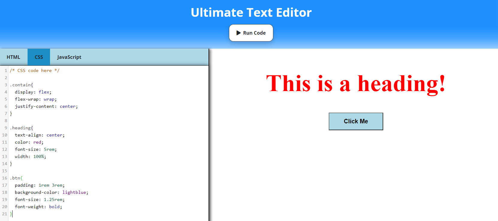

# UltimateTextEditor

## Description

A fully functional online text editor complete with a preview window to view compiled code. Can execute anything coded with HTML, CSS, and Javascript. Also includes features such as autocomplete and auto tags. No installation needed.

## Usage
1. Git clone the repository
2. Open the code in a text editor
3. Find the index.html file, and open it in your browser

## Made With
* HTML
* CSS
* Bootstrap
* JavaScript

## Demo Link
https://chance-crawford.github.io/UltimateTextEditor/
